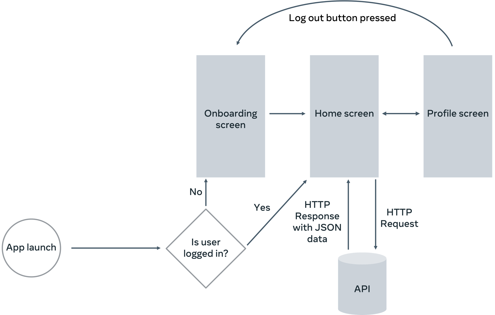

  

<h1 align="center"> android-app-little-lemon-capstone</h>

  
  

## Little Lemon Ordering App - Food Menu Integration
This project is part of my Meta Development Specialization provided by Meta on Coursera. In this project I completed my final assignment from the course called "Android App Capstone".

## Little Lemon Digital Menu

# Little Lemon Ordering App - Food Menu Integration

## Overview

In this exercise, you'll integrate a food menu feature into the Little Lemon ordering app. The task involves fetching menu data from a remote server, storing it in an SQLite database, and displaying it on the app's Home screen. You'll utilize Ktor for network operations and Room for local data storage.

## Scenario

For the Little Lemon ordering app, you're tasked with fetching, storing, and displaying the food menu data. The goal is to connect to a remote server via an API to retrieve menu items and display them in the app. The app's flow diagram illustrates how the app connects to the API using HTTP.

## Prerequisites

Before proceeding, ensure you've completed the application onboarding and have set up all application screens, including navigation.

## Step 1: Configure Dependencies

Begin by adding the necessary dependencies to your project. In the `app/build.gradle` file, include Ktor dependencies for HTTP client operations, along with Kotlin serialization for JSON parsing. Additionally, integrate Room for local database operations.

## Step 2: Fetch the Menu

After connecting to the API and fetching the JSON data, convert it into a Kotlin-friendly format. Create a `Network.kt` file under your application package to define the data classes `MenuNetwork` and `MenuItemNetwork` with serialization annotations. In your `MainActivity`, initialize the Ktor HTTP client and use it to fetch and decode the menu items.

## Step 3: Store Data in a Room Database

Once you've fetched the menu items, store them locally using Room. Create a `Database.kt` file to define the database, DAO, and entity data class representing the menu items. In your `MainActivity`, map the network data models to Room entities and save the data to the local database.

## Step 4: Display Restaurant Details

Before showcasing the menu items, enhance the Home Composable with a hero section. Implement the UI for the hero banner that includes the restaurant's name, city, and a short description. Integrate the hero image from the app's assets.

## Step 5: Display Menu Items

Define the `MenuItems` Composable to display the fetched menu items below the hero section. Retrieve the items from the Room database and use a Column layout to organize them vertically. For each menu item, display its title, price, description, and image. Utilize Glide Compose to load images using the URLs provided in the menu item attributes.

## Conclusion

You've now successfully integrated the food menu feature into the Little Lemon ordering app. The app can fetch menu data from a remote server, store it locally using Room, and display it on the Home screen.
